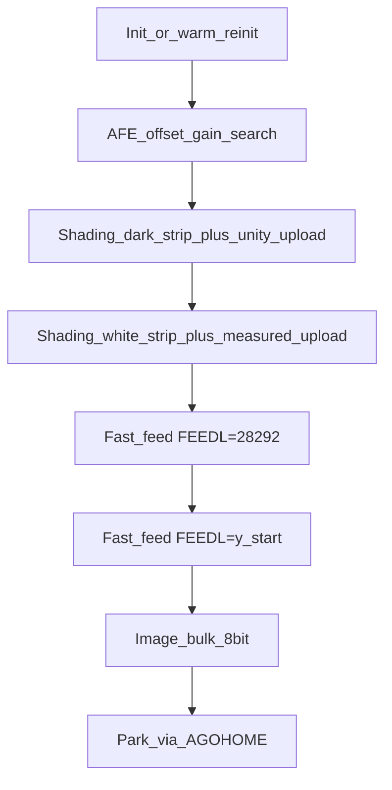
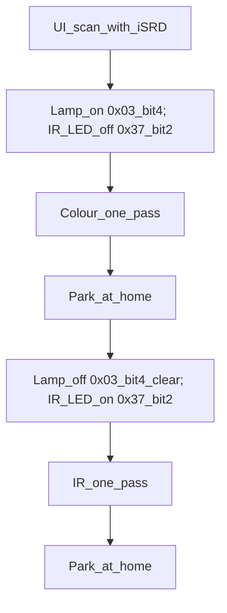
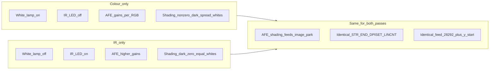

# SilverFast scan flow (capture-derived)

How SilverFast 9 drives the OpticFilm **8200i SE** (GL128), synthesized from
sessions [`03`](03_home_or_preview/), [`04`](04_color_1800/),
[`05`](05_ir_1800/), and [`10`](10_back_to_back/). Values change with DPI/crop;
the **sequence does not**.

Detail: [`PROTOCOL.md`](PROTOCOL.md) · AFE/shading: [`CALIB.md`](CALIB.md) ·
feeds: [`MOTOR.md`](MOTOR.md).

---

## 1. One pass (colour or IR)

Every full colour job, and each half of an iSRD job, is this pipeline.

### Register / depth notes (Lab-critical)

| Stage | Depth | `0x02` motor | Other |
|-------|-------|--------------|--------|
| AFE strips | 16-bit | stationary (`0x00`) | Narrow window (~512 px); FE `0x02`–`0x07` |
| Shading pass 1 | 16-bit, 128 lines | **`0x00`** | Dark + unity white upload → AHB `0x10014000` |
| Shading pass 2 | 16-bit, 128 lines | **`0x10`** (`MTRPWR` only) | Measured white; DVDSET for later image |
| Fast feeds | — | `0x18` → done `0x08` | Fast slope table; START is `0x0f` only |
| Image | 8-bit USB | **`0x30`** (`AGOHOME`\|`MTRPWR`) | `FEEDL=1`; same `STRPIXEL`/`ENDPIXEL`/`DPISET` as shading window |
| Park | — | AGOHOME side-effect | No standalone `FEEDL=0` home |

Shading acquire width = image window pixels (e.g. 2478 @ 1800); upload padded to
declared table N (e.g. 2517). See [`CALIB.md`](CALIB.md).

---

## 2. iSRD (session 05) — two full pipelines

iSRD is **not** a half-scan or GPO mux. It is the one-pass pipeline **twice**,
same geometry, then park between passes (session 10 confirms AGOHOME before the
next cycle).

### IR illumination during calib (session 05)

SilverFast toggles `0x37` bit 2 during the IR pipeline rather than setting it
once: dark-oriented steps can run with the IR LED off; white strip and image run
with it on. White lamp stays off for the whole IR pass (`0x03` bit 4 clear).

Geometry, slope tables, and GPO are **byte-identical** across colour and IR →
pixel-aligned RGB + IR mask.

Each pass has its **own** AFE search and ASIC shading table (IR table: dark≈0,
near-equal channel whites).

---

## 3. Colour vs IR — what actually differs

Same motor and geometry path. Only illumination (and the resulting calib tables)
change.

| | Colour (pass 1) | IR (pass 2) |
|--|-----------------|-------------|
| `0x03` bit 4 (white lamp) | set | clear |
| `0x37` bit 2 (IR LED) | clear | set for white/image |
| GPO `0xa5`–`0xaf` | unchanged | unchanged |
| AFE | lower gains (e.g. ~`0x14`/`0x22`/`0x16`) | higher (~`0x30`/`0x29`/`0x31`) |
| Shading dark | nonzero, channel-spread | all `0` |
| Shading white | channel-spread | nearly equal |

---

## Lab alignment reminder

Capture order is **shade while motor is not doing feeds**, then position, then
image with `AGOHOME`. Lab must not run ASIC shading strips after the bring-up
motor gate is armed for feeds — see [`CALIB.md`](CALIB.md) HW validation.
